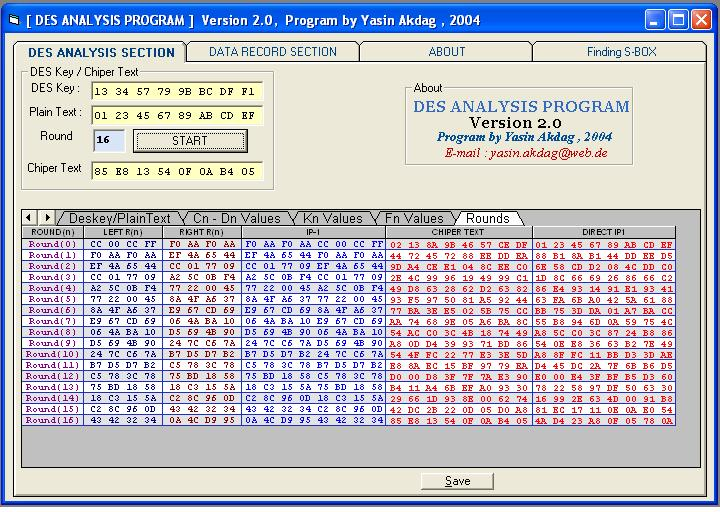



## DES\-ANALYSIS Program

### Description

Quite a good DES-Analyse Program to understand and test every step of DES, his Rounds,

the relationship to S-boxes und so on ...

The program needs VCI Formula One Library (VCF132.OCX)
 
### More Info
 

             |
---                |---
**Submitted On**   |2004-01-15 05:43:00
**By**             |[Yasin Akdag](https://github.com/Planet-Source-Code/PSCIndex/blob/master/ByAuthor/yasin-akdag.md)
**Level**          |Intermediate
**User Rating**    |5.0 (10 globes from 2 users)
**Compatibility**  |VB 6\.0
**Category**       |[Encryption](https://github.com/Planet-Source-Code/PSCIndex/blob/master/ByCategory/encryption__1-48.md)
**World**          |[Visual Basic](https://github.com/Planet-Source-Code/PSCIndex/blob/master/ByWorld/visual-basic.md)
**Archive File**   |[DES\-ANALYS1799891022004\.ZIP](https://github.com/Planet-Source-Code/yasin-akdag-des-analysis-program__1-56486/archive/master.zip)

